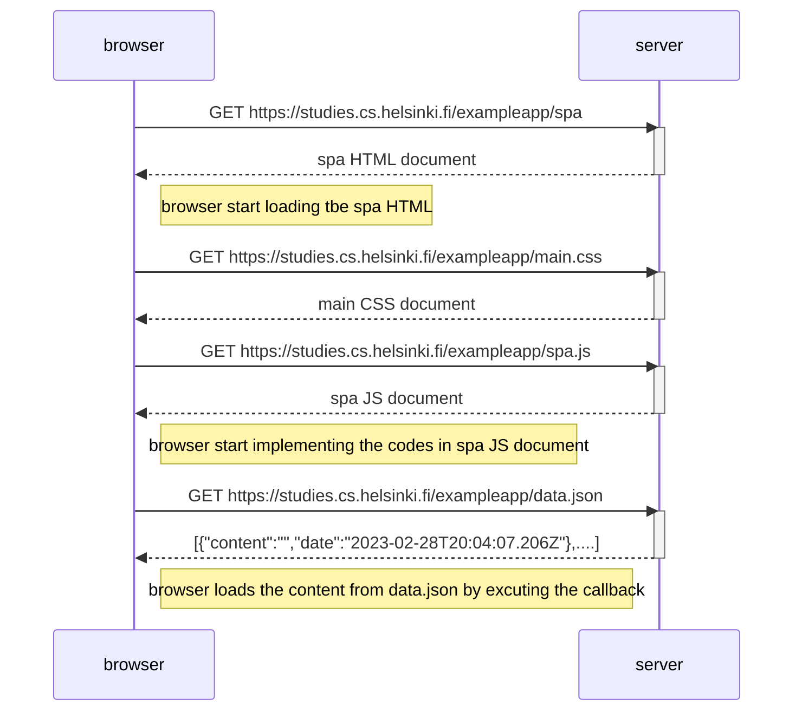

# Single Page App Diagram

```mermaid
sequenceDiagram
participant browser
participant server

browser ->> server : GET https://studies.cs.helsinki.fi/exampleapp/spa
activate server
server -->> browser : spa HTML document 
deactivate server

note right of browser: browser start loading tbe spa HTML

browser ->> server : GET https://studies.cs.helsinki.fi/exampleapp/main.css
activate server
server -->> browser : main CSS document 
deactivate server

browser ->> server : GET https://studies.cs.helsinki.fi/exampleapp/spa.js
activate server
server -->> browser : spa JS document 
deactivate server

note right of browser: browser start implementing the codes in spa JS document 

browser ->> server : GET https://studies.cs.helsinki.fi/exampleapp/data.json
activate server
server -->> browser : [{"content":"","date":"2023-02-28T20:04:07.206Z"},....]
deactivate server

note right of browser: browser loads the content from data.json by excuting the callback 


```